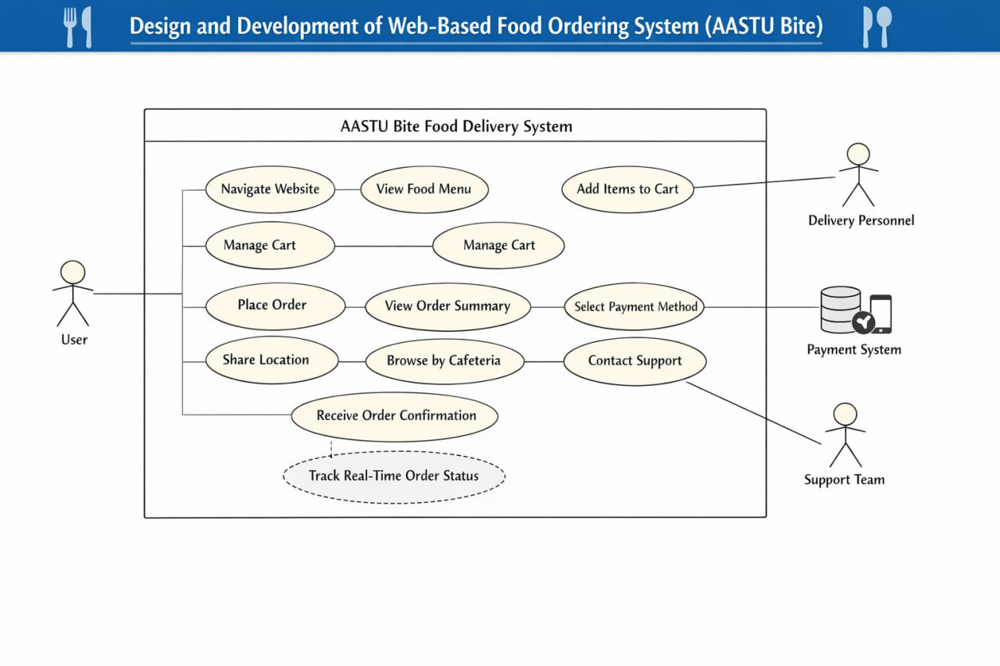

# 🍴 AASTU Bite — Student Cafeteria Food Ordering System
*(Serving Central & KK cafeterias at AASTU — Phase 1 Prototype)*

---

## 🌟 Project Title
**AASTU Bite:** Student Cafeteria Food Ordering Website  

---

## 👥 Team / Organization
- **Organization:** AASTU Bite Team  
- **Course:** Internet Programming I (Mini Project)  
- **Institution:** Addis Ababa Science and Technology University (AASTU)  

---

## 📚 Introduction
AASTU Bite is a **web-based food ordering system** designed to simplify and modernize food ordering at AASTU. Students can browse menus, add items to a cart, select the cafeteria (Central or KK), and submit orders online.  

This system is a **Phase 1 prototype**, focusing on front-end features while preparing for **backend integration, GPS/map delivery, notifications, and mobile app expansion** in future phases.  

---

## 🌍 Context
At AASTU, students depend on multiple cafeterias for daily meals. Currently:  

- Ordering requires **calling the cafeteria or standing in long queues**  
- Staff face **high workloads and order management challenges**  
- Students experience **frustration and delays**, especially during peak hours  

The system will operate in the **university environment**, serving students and cafeteria staff, and will eventually expand to include all cafeterias with GPS delivery and backend support.  

---

## 🚀 Motivation
- Reduce waiting times and improve ordering convenience  
- Provide a **modern, interactive front-end solution**  
- Prepare for **future GPS/map-based delivery and mobile app integration**  
- Support cafeteria staff by reducing workload and errors in order handling  

---

## 🎯 Objectives

### General Objective
Develop a **dynamic, web-based food ordering system** for AASTU cafeterias.  

### Specific Objectives
- Design a **responsive, user-friendly website**  
- Implement **dynamic menu browsing and cart management**  
- Allow students to **choose the cafeteria** (Central or KK)  
- Collect student information via **validated order forms**  
- Display **order summary and confirmation**  
- Prepare for **future backend integration and database storage**  
- Plan for **GPS/map delivery and notifications**  
- Ensure **future scalability** for additional cafeterias  

---

## 📌 Corresponding Requirements
| Objective | Requirement |
|-----------|-------------|
| Responsive website | HTML5, CSS3, JavaScript with responsive design |
| Dynamic menu browsing | Menu pages with images, descriptions, availability |
| Cafeteria selection | Ability to select Central or KK during order |
| Cart management | Add/remove items, update quantities, dynamic total |
| Form validation | JavaScript checks for student info & order accuracy |
| Order summary | Show final order details before submission |
| Backend preparation | Modular code for future PHP/MySQL integration |
| GPS/Map delivery (future) | System design prepared for location selection & tracking |
| Notifications (future) | Alerts when order is ready |
| Scalability | Architecture supports expansion to other cafeterias |

---

## 🍔 Functional Requirements
1. Home Page – Quick navigation and featured menu items  
2. Menu Pages – Food items with images, descriptions, prices, availability  
3. Cafeteria Selection – Central or KK for each order  
4. Cart System – Add/remove items, update quantities, dynamic total  
5. Order Form – Collect student info (name, ID, contact, cafeteria)  
6. Order Validation – Ensure accurate data submission  
7. Order Summary – Display before final submission  
8. Responsive Design – Mobile and desktop friendly  
9. Future GPS/Map Delivery – Select drop location and track orders  
10. Notifications – Alerts when orders are ready  
11. Adaptive Features – Recommend popular items based on previous orders  

---

## 💡 Significance of the System
- Reduces waiting time for students  
- Minimizes staff workload and errors  
- Provides **interactive, convenient, and scalable ordering**  
- Prepares a foundation for **future backend, mobile, and GPS delivery features**  

---

## 👥 Beneficiaries of the System
- **Students:** Faster, easier food ordering  
- **Cafeteria staff:** Better order management and preparation workflow  
- **University administration:** Improved cafeteria service efficiency  

---

## 🔧 Feasibility Analysis

### Technical Feasibility
- Front-end prototype using **HTML, CSS, JavaScript**  
- System can be integrated with **PHP/MySQL backend** in Phase 2  
- Prepared for **future GPS/map delivery using APIs**

### Economic Feasibility
- Development uses **open-source technologies**  
- No high-cost servers needed for Phase 1  
- Potential savings in staff time and improved service efficiency

### Operational Feasibility
- Easy for students to use  
- Simple for cafeteria staff to implement order preparation workflow  
- Scalable for future expansion to other cafeterias  

---

## 📄 SRS Overview of Existing System (beU Delivery)

### Use Case of Existing System (Reference)
**beU Delivery** is a commercial Ethiopian food delivery app:  
- Connects users with multiple restaurants  
- Offers app-based ordering, cart, payment, and GPS tracking  
- Digital wallet, discounts, and referral rewards  

**Actors:** Customers, Delivery Staff  

**Flow:**  
1. Customer selects restaurant and food → adds to cart → pays → tracks delivery  
2. Delivery staff receives order → picks up → delivers → updates status  

### Problems & Limitations
- Not campus-focused, only city-wide delivery  
- Requires mobile app and account creation  
- Delivery can be unreliable or slow  
- Does not handle cafeteria-specific ordering workflows  

---

## 🆕 Proposed System

### Use Case of AASTU Bite
 
**Use Case Diagram:**  

---
**Phase 2+ Future Improvements:**  
- GPS/map for delivery tracking  
- Notifications when order is ready  
- Backend database for order storage  
- Mobile app version  
- Expansion to additional cafeterias  

**Improvements over Existing System:**  
- Campus-specific, affordable, and easy to use  
- Scalable for future cafeterias and mobile integration  
- Designed to handle student authentication and order history  

---

## 🌟 Featured Products / Adaptive
- Dynamic menu recommendations based on student usage  
- Adaptive order suggestions (Phase 2+)  
- Modular code ready for backend integration  

---

## 📄 Demonstration (Second Page)
- Phase 1 prototype: fully functional front-end  
- Responsive web pages for home, menu, cart, and order submission  
- Cafeteria selection (Central & KK) implemented  
- Cart dynamically updates totals  
- Order summary confirms student info and selections  

---

Prepared for **Internet Programming I — AASTU**
